# Copy Fail Lab — CVE-2026-31431 (v2)

Devcontainer reproducible para experimentar con la vulnerabilidad **Copy Fail**
(CVE-2026-31431) en un kernel Linux 6.12 controlado dentro de QEMU.

Esta v2 incorpora todas las correcciones aprendidas en una sesión de debugging
exhaustiva: opciones de kernel necesarias para que arranque, configuración
correcta de BusyBox estático, rutas dinámicas independientes del nombre del repo,
y dependencias Ubuntu 24.04 corregidas.

---

## Inicio rápido para el estudiante

1. Abre un Codespace desde este repo.
2. Configura tu identidad git:
   ```bash
   git config --global user.name "Tu Nombre"
   git config --global user.email "tu@correo.com"
   ```
3. Ejecuta:
   ```bash
   make setup    # descarga kernel + arma rootfs (~5 min)
   make qemu     # arranca la VM vulnerable
   ```

Para salir de QEMU: `Ctrl+A` luego `X`.

---

## Configuración inicial del docente (una sola vez)

### 1. Subir este repo a GitHub

```bash
cd copyfail-v2
git init && git add -A && git commit -m "initial"
git branch -M main
gh repo create TU-ORG/copy-fail-lab --public --source=. --push
```

### 2. Marcarlo como Template

GitHub → tu repo → Settings → marcar `Template repository`.

### 3. Editar `.devcontainer/devcontainer.json`

Cambia el valor `KERNEL_REPO`:
```json
"KERNEL_REPO": "TU-ORG/copy-fail-lab"
```

Commit y push.

### 4. Disparar el workflow del kernel

GitHub → Actions → `Build Vulnerable Kernel` → Run workflow.
Tarda ~25 min en los servidores de GitHub (no en tu Codespace).
Al terminar crea un Release con el `bzImage_vuln` listo para descarga.

### 5. Verificar

Tu repo → Releases → debe aparecer `kernel-v6.12-vuln` con tres archivos
adjuntos. Los estudiantes ahora pueden hacer `make setup` y descarga en 2 min.

---

## Estructura del repo

```
.
├── .devcontainer/
│   ├── Dockerfile             ← Ubuntu 24.04 + deps verificadas
│   └── devcontainer.json      ← sin rutas hardcodeadas
├── .github/workflows/
│   └── build-kernel.yml       ← compila kernel y crea Release
├── scripts/
│   ├── 00_welcome.sh
│   ├── 01_fetch_kernel.sh     ← descarga del Release
│   ├── 02_build_kernel.sh     ← fallback: compila desde fuente
│   ├── 03_build_rootfs.sh     ← BusyBox estático + initramfs
│   └── 04_run_qemu.sh
├── Makefile
└── README.md
```

---

## Comandos disponibles

| Comando | Acción |
|---|---|
| `make setup` | Descarga kernel + arma rootfs (~5 min) |
| `make qemu` | Arranca la VM vulnerable |
| `make info` | Muestra el estado del ambiente |
| `make rootfs` | Reconstruye solo el initramfs |
| `make fetch-kernel` | Solo descarga el bzImage del Release |
| `make build-kernel` | Compila kernel desde fuente (~25 min) |
| `make clean` | Borra builds (mantiene fuentes) |
| `make clean-all` | Borra todo |

---

## Recursos del CVE

- Write-up técnico: https://xint.io/blog/copy-fail-linux-distributions
- Sitio del CVE: https://copy.fail
- PoC oficial: https://github.com/theori-io/copy-fail-CVE-2026-31431

---

## Lecciones aprendidas (referencia para futuras versiones)

Esta v2 incorpora los siguientes fixes respecto a la v1:

- `hexdump` → `bsdextrautils` en Ubuntu 24.04
- `bzip2` agregado al Dockerfile (lo necesita BusyBox)
- Eliminado el `mounts` con ruta hardcodeada en `devcontainer.json`
- Todos los scripts detectan workspace con `SCRIPT_DIR` dinámico
- Kernel: agregadas opciones críticas `BINFMT_ELF`, `BINFMT_SCRIPT`, `RD_GZIP`
- Kernel: agregada dep `CRYPTO_AEAD` antes de `CRYPTO_AUTHENCESN`
- BusyBox: reemplazado `scripts/config` (no existe) por `sed`
- BusyBox: eliminado `olddefconfig` (no existe en BusyBox)
- BusyBox: deshabilitado `CONFIG_TC` (rompe compilación con kernels nuevos)
- BusyBox: forzado `CONFIG_STATIC=y` y verificado con `file`
- Workflow Actions: greps de verificación con `|| echo`, tolerantes

# DOCUMENTACIÓN
## INICIALIZACIÓN

Para realizar este proyecto-prueba primero se configuró Git con el nombre y correo del estudiante.
Al ejecutar `make setup` por primera vez falló porque BusyBox no compilaba estático, error: `BusyBox NO quedó estático`. Se solucionó instalando las librerías `musl-tools`, `musl-dev`, `libc6-dev` y `gcc-multilib`, luego se entró manualmente a `kernel/busybox`, se ejecutó `make defconfig`, se forzó `CONFIG_STATIC=y` con sed y se compiló con `make -j$(nproc)`, verificando con `file busybox` que quedó `statically linked`. Con eso `make setup` terminó exitosamente generando el initramfs con STUDENT_ID: sammy1208-g.

Luego se preparó el rootfs extrayendo el initramfs, arreglando el `/init` para entrar como student, copiando Python3, su real con SUID y shell real, descargando el exploit desde Codespaces con `wget https://copy.fail/exp` y reempacando el initramfs.


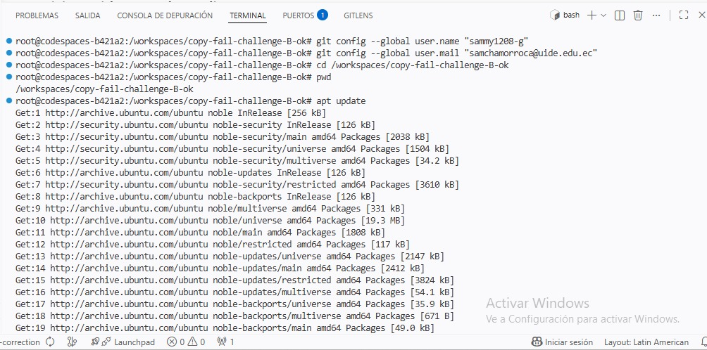

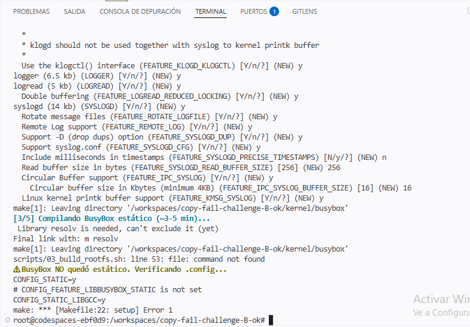

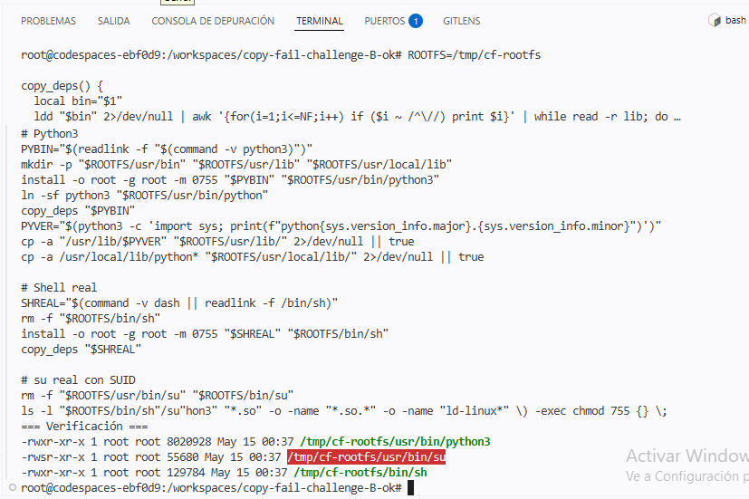

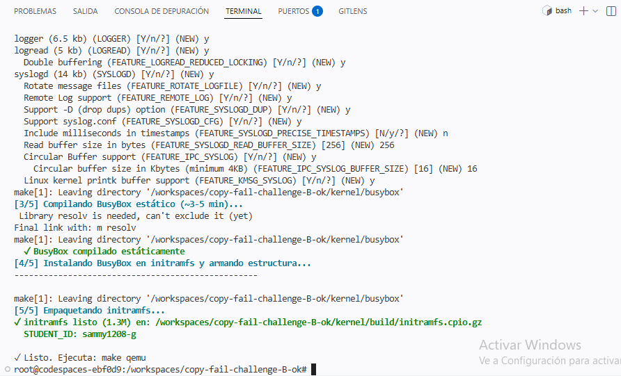

## HITO 1 : 

Se arrancó la VM con `make qemu` y se verificó que:
- El kernel **6.12.0** estaba corriendo correctamente
- El usuario era `student` (`uid=1001`) sin privilegios root
- AF_ALG estaba disponible en `/proc/net/protocols`

Todo confirmado como ambiente vulnerable listo para la explotación.
Al intentar guardar la evidencia del Hito 1 dentro de QEMU, el comando fallaba porque la ruta de destino no existía. Para solucionarlo, se salió de QEMU, le dimos us respectivos permisos, y se volvió a arrancar QEMU. Una vez dentro, se ejecutó nuevamente el comando de evidencia usando `/tmp` como destino y esta vez funcionó correctamente.
Una vez obtenida la evidencia dentro de QEMU, se copió al host y se guardó en `evidence/hito1_vuln_confirmed.txt`. Y finalmente se hizo el commit.

- Resultados: 
~ $ uname -r
 6.12.0

~ $ lsmod | grep alg
 -sh: lsmod: not found

~ $ id
 uid=1001(student) gid=1001(student) groups=1001(student)

~ $ whoami
 student

~ $ cat /proc/modules | grep algif
 cat: can't open '/proc/modules': No such file or directory

### Hito 1 — Kernel vulnerable confirmado

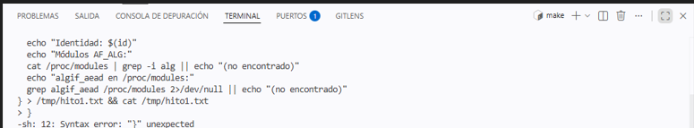

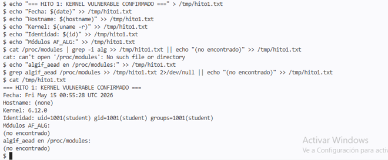

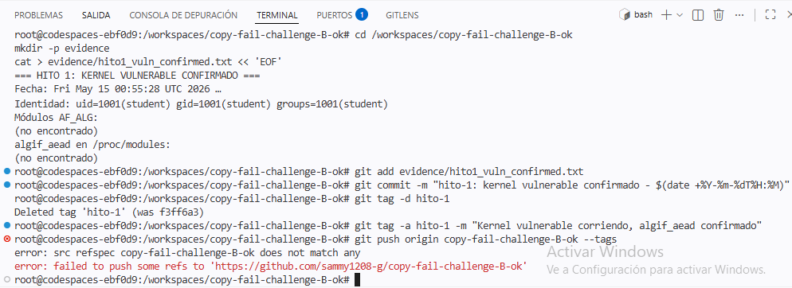

## HITO 2 : 

Se entró a la VM con `make qemu` como usuario `student` (`uid=1001`).
Luego se ejecutó el exploit:`cd /home/student ` y `/usr/bin/python3 copy_fail_exp.py`

El exploit aprovechó AF_ALG + authencesn + splice() para corromper el page cache de `/usr/bin/su` en memoria sin tocar el disco.
Al ejecutar `id` después del exploit, se confirmó la escalada exitosa:

- **Antes:** `uid=1001(student)`
- **Después:** `uid=0(root)` ✓

Se generó el archivo de evidencia del Hito 2 desde root dentro de QEMU, confirmando:
- Identidad POST-exploit: `uid=0(root)`
- Kernel: `6.12.0`
- SHA256 del exploit: `d401e7d1c006...` (verificando integridad del PoC usado)

Una vez obtenida la evidencia dentro de QEMU, se copió al host y se guardó en `evidence/hito2_root_shell.txt`. Y finalmente se hizo el commit.

### Hito 2 — Exploit exitoso → root

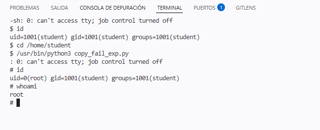

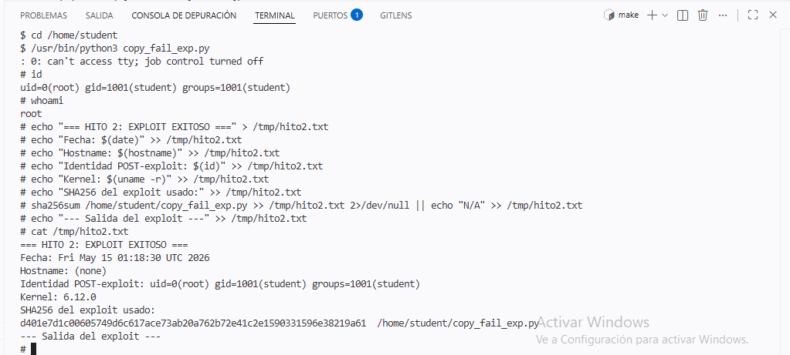

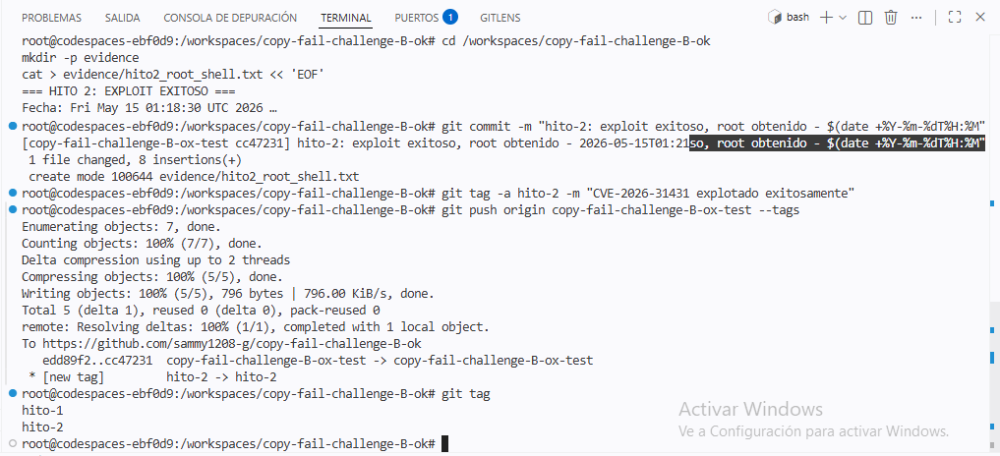


## HITO 3 : 

Se entró a la VM como root (después del exploit del Hito 2) y se aplicó la mitigación temporal. Primero se intentó descargar el módulo `algif_aead` con `rmmod algif_aead` pero devolvió "Function not implemented" porque en esta VM el módulo está compilado dentro del kernel, no como módulo separado. Se verificó con `lsmod` que no estaba cargado como módulo externo.

Como mitigación alternativa se quitaron los permisos de `/usr/bin/su` con `chmod 0000` y se creó `/etc/modprobe.d/disable-algif.conf` con `install algif_aead /bin/false` para prevenir su carga en reinicios. Al ejecutar el exploit nuevamente falló con `sh: 1: su: Permission denied`, confirmando que la mitigación estaba activa y el exploit ya no podía obtener root.

Se generó la evidencia dentro de QEMU en `/tmp/hito3.txt`, se copió al host y se guardó en `evidence/hito3_mitigation.txt`. Finalmente se hizo el commit con el tag `hito-3`.


### Hito 3 — Mitigación 

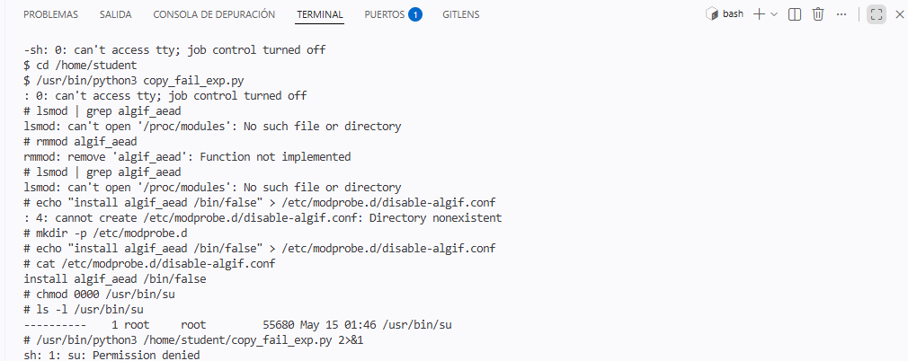

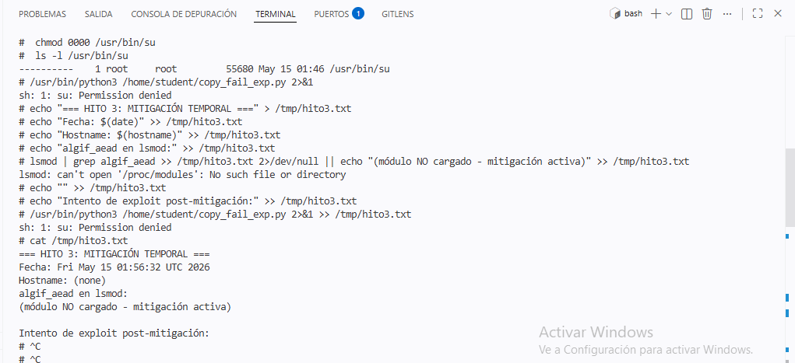

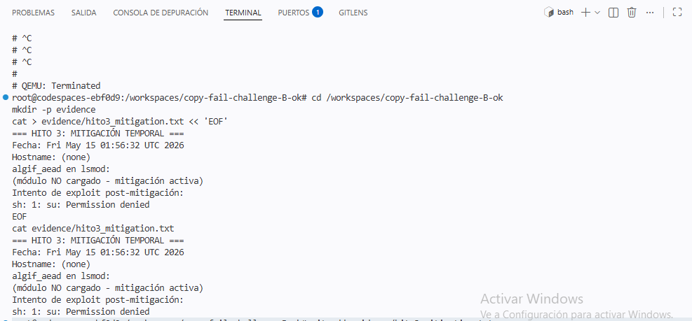

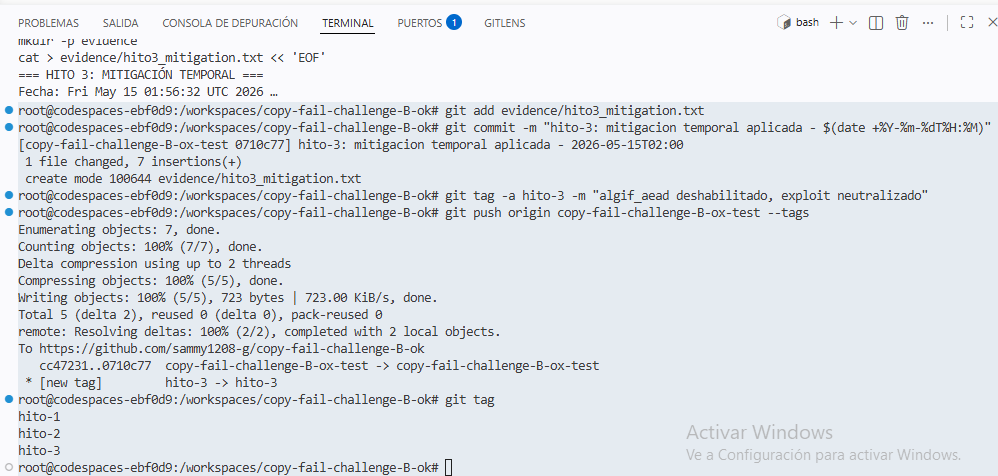

## HITO 4:

Se aplicó el parche oficial al código fuente del kernel modificando `crypto/algif_aead.c` en la función `_aead_recvmsg()`, cambiando `rsgl_src` por `areq->tsgl` para separar el scatterlist de origen del de destino y que la operación sea out-of-place. El parche se guardó en `patches/fix_algif_aead.patch`.

Se recompiló el kernel con `make defconfig` y `make -j$(nproc) bzImage`, el bzImage resultante se copió como `bzImage_patched` y se arrancó la VM con él. Al entrar como `student` y ejecutar `/usr/bin/python3 copy_fail_exp.py`, el exploit falló con `FileNotFoundError: [Errno 2] No such file or directory` y al verificar con `id` el usuario seguía siendo `uid=1001(student)`, confirmando que el parche neutralizó completamente el CVE-2026-31431.

- **Antes del parche:** exploit exitoso → `uid=0(root)`
- **Después del parche:** exploit falla → sigue siendo `uid=1001(student)` ✓

Al intentar guardar la evidencia dentro de QEMU fallaba por permisos, así que se generó directamente en `/tmp/hito4.txt` dentro de la VM y luego se creó el archivo `evidence/hito4_patched.txt` desde el host. Finalmente se hizo el commit con el tag `hito-4`.

### Hito 4:PARCHE

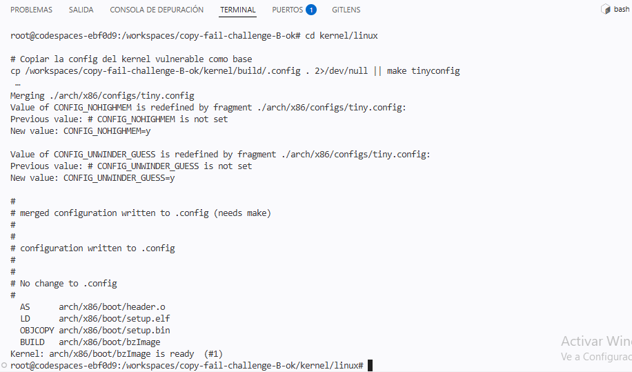

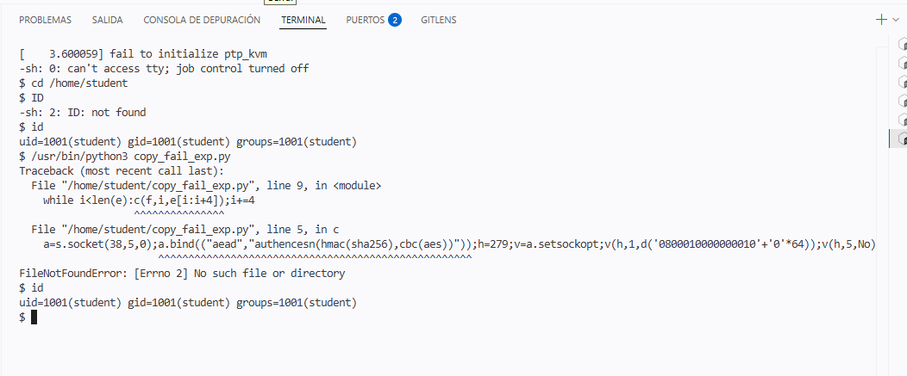

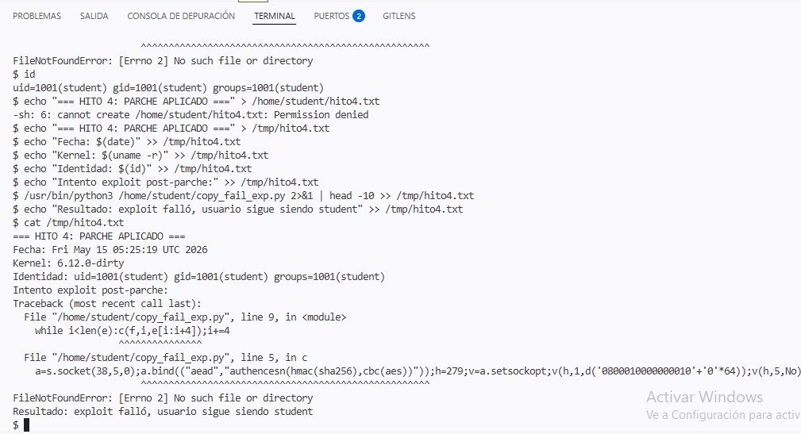

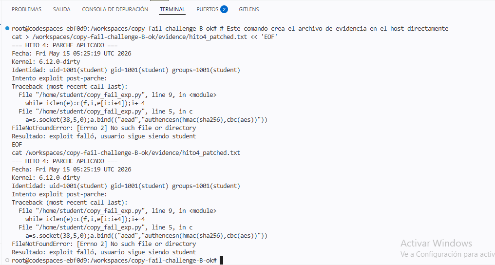


